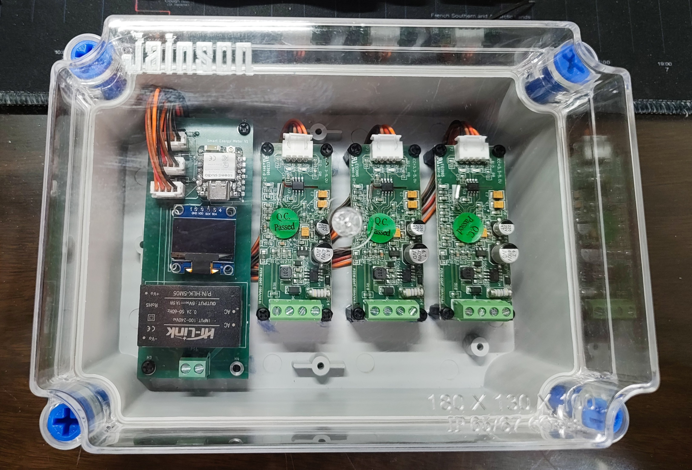
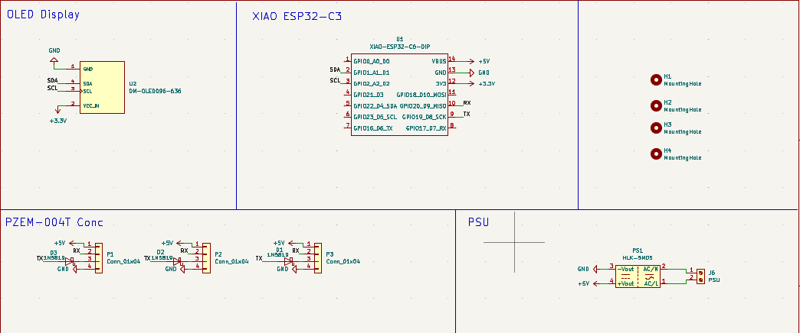
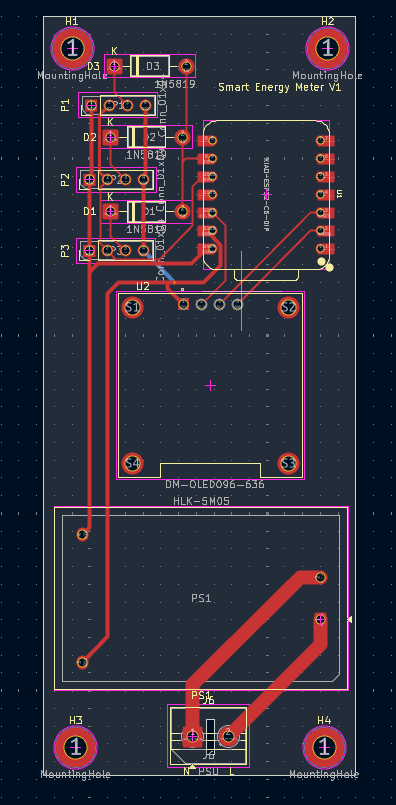
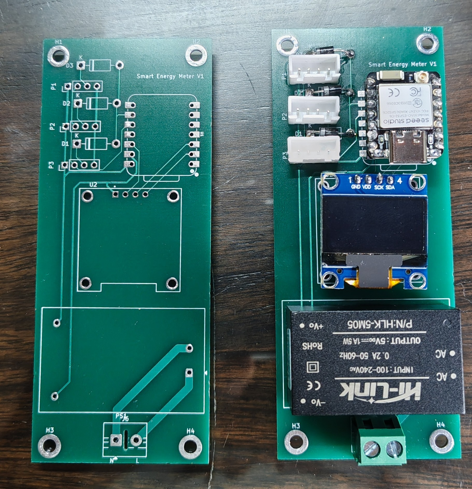
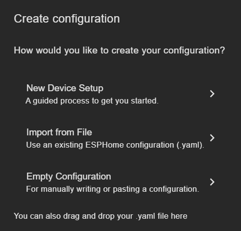

# Smart-3-Phase-Enrgy-Meter
An ESPHome-based energy meter powered by PZEM-004T V4 and Seed Studio Xiao ESP32-C6/ESP32-C3
 

  

## Componenets
1. [Seed Studio Xiao C6](https://www.seeedstudio.com/Seeed-Studio-XIAO-ESP32C6-p-5884.html) OR Xiao C3
2. [PZEM-004T V4](https://robu.in/product/pzem-004t-with-coil-ct-with-outcasehot-ac-meter/)
3. [SSD1306 0.96 OLED Display](https://quartzcomponents.com/products/oled-display-0-96-inch-i2c-interface-4-pin-blue-ssd1306)
4. [Hi-Link 5V 5W PSU (HLK 5M05)](https://robu.in/product/hlk-5m05-5v-5w-switch-power-supply-module/?gad_source=1&gad_campaignid=17427802559&gbraid=0AAAAADvLFWdyY2DiddMgGUwxKQrgYGrId&gclid=CjwKCAjwq6DQBhBVEiwA4ZD5XINyfahhBX2IyH8qCKN4hPUuXApgPumztB-3vMhQIovpEZZ0PR9EfBoCjpYQAvD_BwE)
5. [1N5819 Schottky barrier diode](https://robu.in/product/1n5819-1w-diode-pack-of-30/)
6. [4 Pin JST XH Male Connector - 2.54mm pitch](https://quartzcomponents.com/products/4-pin-jst-xh-male-connector-5-24mm-pitch)
7. [4 Pin JST Female to Female Connector - 2.54mm Pitch](https://quartzcomponents.com/products/4-pin-jst-female-to-female-connector-2-54mm-pitch)
8. [2 Pin Screw Terminal Block - 5mm Pitch](https://quartzcomponents.com/products/2-pin-pcb-mount-terminal-block-screw-type)
9. [Transparent Junction Box(180X130X100)](https://amzn.in/d/0d2WMVyG)

## Schematics 
 

  

> [!NOTE]
>If ESPHome is unable to read from all three PZEM modules simultaneously, it is because multiple devices prevent the signal from dropping close enough to GND. To fix this, it is recommended to place a 1N5819  Schottky diode on the TX line of each PZEM .  Which I have included in the schematics as well as  in the PCB 

## PCB 

<table align="center">
  <tr>
    <td align="center">
       
    </td>
    <td align="center">
       
    </td>

  </tr>
</table>

## Installtion 
1. Download the configuration of your board (c3 or c6), which can be found [HERE](/ESPHOME), and simply go to your ESPHome instance and "import from file" as shown in the picture 
  

  

2. Set the address to each of the Pzem-004T's using a USB to TTL Serial Adapter as follows

> [!NOTE]
> The address can also be changed in ESPHome, but this is recommended 

|Phase|Address|
|:--:|:--:|
|P1|0x01|
|P2|0x02|
|P3|0x03|

## Refrence
1. [ESPHome Pzem-004T Docs](https://esphome.io/components/sensor/pzemac/)
2. [ESPHome SSD1306 OLED Display Docs](https://esphome.io/components/display/ssd1306/)
3. [Multiple Pzem Communication Error forum](https://community.home-assistant.io/t/pzem-004t-v4-0-esphome-not-able-to-read-simultaneously-from-all-3-pzems/957478/2)

